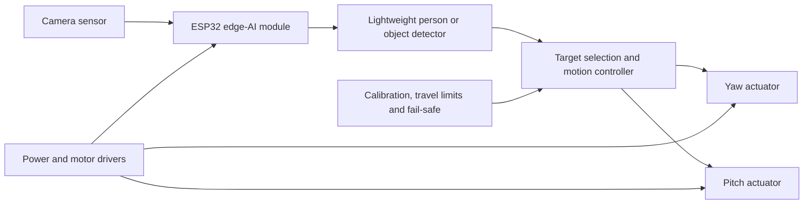

# Tracker Bot

## EVT-A.1 build and teaching manual (5 October 2026)

The implemented reference build is **XIAO ESP32-S3 Sense + two SG90 servos**
tracking a red marker. It is an untested hardware draft; it does not yet detect
people. The earlier product vision below describes future goals.

[Engineering manual](docs/engineering.md) · [BOM](hardware/BOM.md) ·
[Wiring schematic](hardware/schematic.svg) · [Placement drawing](mechanical/placement.svg) ·
[STEP draft](mechanical/layout-draft.step)

**Wiring revision:** EVT-A.1 uses TXU0102, not the old AHCT125. Read the
[power-cut and interlock guide](docs/power-and-interlock.md) and
[parametric mounting drafts](mechanical/README.md). Do not reuse the old pinout.

1. Read the wiring and power notes. Keep the camera USB and motor supplies separate;
   join ground. Wire GPIO1/D0 and GPIO2/D1 through the translator, GPIO3 to OE,
   and GPIO4 to the separate NC stop contact with its 3.3 V pull-up.
2. Install PlatformIO and run `cd firmware`, then `pio run -e xiao-sense`.
3. With horns removed and motor power off, connect USB and run
   `pio run -e xiao-sense --target upload`, then `pio device monitor`.
4. Boot should report motors DISARMED. Verify no PWM. Enable motor power, support
   the mechanism, close the stop contact, then enter `arm`; the last commanded
   position (initially centre) can cause movement. Release after a stop does not re-arm.
5. Try `target 0.2 0` in serial mode. Check direction and timeout before fitting
   the horns. `stop` holds position; `disarm` removes PWM. Use the physical cut if needed.
6. Enter `camera` and present one red marker. Remove it to check lost-target behaviour.
   Enter `serial` to return to manual target input. Use `status` for diagnostics.
7. Follow the four lessons in the engineering manual and save the measured results.

Read the [camera freshness and calibration lesson](docs/camera-calibration.md)
before marker tracking. Frame age is measured from capture start, not retrieval.
`status` reports the last frame classification, red sample/candidate/selected
counts and capture age. Two separate qualifying red regions now reject as
`ambiguous`; a unique region needs at least 20 connected samples. Touching objects
can still merge, and a lone distractor can still qualify—this is not identity tracking.
Loss stops incremental commands but holds PWM; a valid marker can automatically
resume tracking while camera mode remains selected. Use `stop`, `serial` or
`disarm` to prevent that automatic resumption. No encoder or obstruction sensor
is implemented, and physical stopping remains unvalidated.

Serial control now rejects malformed or unknown commands by stopping tracking
and leaving camera mode. Lines are limited to 96 ASCII bytes and must finish
within one second of their first processed byte. Rejected lines are discarded
through the next newline. Read the [serial controls lesson](docs/serial-controls.md)
before attaching scripts; stopping increments still holds PWM, not motor power.

The CAD now includes [candidate moving carriers and joint-frame review](mechanical/carrier-review.md),
with a [labelled STEP-derived assembly review](mechanical/carrier-visual-review.png)
showing assumed actuator axes, camera envelope and unfinished horn connections,
not a finished pan/tilt mechanism. Run `python tools/build_engineering.py --cad`,
`python tools/build_mounts.py`, then `python tools/build_carriers.py` with CadQuery
2.8.0. The last script samples 25 nominal poses and reports envelope intrusion;
it does not certify continuous clearance or measured shaft/optical frames.
Actual motor travel, bracket fit, camera orientation, back-feed,
continuous current and tracking quality remain physical acceptance tests.


A compact, affordable pan-and-tilt camera that follows a selected person or
object using on-device computer vision.

Tracker Bot takes the core idea behind the larger
[YOLO Tracker](https://github.com/Kelvinchan324/YOLO_tracker) and explores how
to turn it into a smaller, quieter, lower-cost product for individual
customers. The proposed design uses an AI-capable ESP32 module for lightweight
tracking and two compact actuators for yaw and pitch.

> **Project status:** early product concept and feasibility study. The camera,
> ESP32 module, actuators, power system, enclosure, and retail specifications
> have not been finalized.

## Product vision

- Small enough for a desk, shelf, tripod, or portable demonstration setup.
- Lower-cost alternative to a Raspberry Pi and full-size smart-servo tracker.
- On-device tracking with low latency and no mandatory cloud connection.
- Simple setup for non-technical B2C customers.
- Smooth, quiet motion suitable for home video, calls, content creation, and
  hobby use.
- Modular mechanical design so the actuator choice can change without a full
  enclosure redesign.

## Proposed system



The intended vision loop is:

1. Capture a low-resolution frame.
2. Run a compact, quantized detection or tracking model on the ESP32.
3. Select a target and calculate its offset from the image center.
4. Apply a deadband and a tuned proportional or PID controller.
5. Command the yaw and pitch actuators within calibrated travel limits.
6. Stop safely when the target is lost, the mechanism is obstructed, or a
   hardware fault is detected.

## Actuator direction

Two candidate products are being considered:

| Candidate | Link | Current status |
| --- | --- | --- |
| A | [Taobao item 611225445203](https://item.taobao.com/item.htm?id=611225445203) | Specifications and compatibility not yet verified |
| B | [Taobao item 1014228956726](https://item.taobao.com/item.htm?id=1014228956726) | Specifications and compatibility not yet verified |

These links are research candidates, not approved parts. Their listings,
prices, availability, specifications, and seller claims can change.

### Small servo motor

Advantages:

- Integrated gearbox and position control can simplify the electronics.
- Easier firmware integration and faster proof-of-concept development.
- Usually cheaper and easier to replace.

Risks to evaluate:

- Gear noise, backlash, vibration, and visible stepping.
- Limited life under continuous tracking motion.
- Motion may not be smooth enough for video.

### Gimbal motor

Advantages:

- Potentially smoother and quieter motion.
- Low backlash and better motion quality for camera applications.

Risks to evaluate:

- Requires a compatible motor driver and control method such as FOC.
- May require an encoder or other position feedback.
- More tuning, electronics, firmware, and calibration effort.
- Total system cost may exceed the cost of the motor itself.

### Required actuator validation

Do not commit the mechanical design until both candidates have been checked
for:

- operating and peak voltage;
- stall, rated, and continuous torque;
- control interface and compatible driver;
- absolute or incremental position feedback;
- speed, response time, and control resolution;
- shaft, mounting-hole, and body dimensions;
- cable and connector requirements;
- current draw, heat, and safe duty cycle;
- acoustic noise, backlash, and vibration;
- repeatability after power cycling;
- unit cost at prototype and production quantities;
- supplier consistency, lead time, and replacement availability.

## ESP32 edge tracking

The exact ESP32 module and camera are still to be selected. The target
implementation should favor:

- an ESP32 variant with enough memory and acceleration for a small vision
  model;
- a camera interface supported by the selected module;
- a small input size and an INT8-quantized model;
- person, face, or single-object tracking rather than a large general-purpose
  detector;
- frame skipping and region-of-interest tracking to reduce compute load;
- motor updates at a stable rate independent of camera inference timing;
- local processing by default, with no required image upload.

The first benchmark should measure detection accuracy, end-to-end latency,
frame rate, memory use, temperature, and power consumption on the actual
ESP32 hardware. Model choice should follow those measurements rather than the
model name alone.

## Product requirements

### Customer experience

- One-button startup and automatic center calibration.
- Clear power, tracking, and privacy indicators.
- Simple target selection and an easy way to pause tracking.
- Stable behavior when the target leaves or re-enters the frame.
- USB-powered operation if the selected motors allow it; otherwise use one
  clearly labeled external supply.
- Replaceable cable and modular actuator assembly.

### Safety and privacy

- Mechanical travel limits and software position limits on both axes.
- Current limiting or stall detection to protect fingers, gears, and motors.
- Controlled startup with no sudden movement.
- Stop motion on camera, feedback, communication, or thermal failure.
- Pinch-point guards and a stable, tip-resistant base.
- On-device processing and no cloud upload by default.
- Visible indication whenever the camera or tracking function is active.
- Secure firmware updates and no undocumented network services.

### B2C readiness

Before sale, the design will need:

- a repeatable bill of materials and at least one backup supplier for critical
  parts;
- design-for-assembly and production test procedures;
- enclosure durability, drop, cable-strain, thermal, and long-duration motion
  tests;
- electrical, battery, radio, and product-safety compliance appropriate to
  every sales region;
- privacy documentation, firmware-update policy, warranty, and support plan;
- manufacturing cost, packaging, fulfillment, returns, and retail margin
  validation;
- freedom-to-operate and software/model licensing review.

## Development roadmap

- [ ] Confirm the first customer use case and target retail price.
- [ ] Buy and bench-test both actuator candidates.
- [ ] Select the ESP32 module, camera, motor drivers, and power architecture.
- [ ] Benchmark a lightweight tracking model on the selected ESP32.
- [ ] Build a two-axis electronics prototype with no camera payload.
- [ ] Establish travel limits, lost-target behavior, and stall protection.
- [ ] Design and print the first compact mechanical prototype.
- [ ] Tune tracking, motion smoothing, and acoustic performance.
- [ ] Run thermal, endurance, drop, and cable-strain tests.
- [ ] Build a small pilot batch and collect customer feedback.
- [ ] Freeze the product specification only after pilot validation.

## Firmware quick start

The repository now includes a basic ESP32-S3 PlatformIO project in
[`firmware/`](firmware/). It can move two PWM hobby servos, receive simulated
target coordinates through the serial monitor, enforce configured travel
limits, and stop issuing incremental targets when updates are lost. Holding a
commanded position is not a verified physical stop.

Open the `firmware` folder as a PlatformIO project in VS Code. See the
[`firmware/README.md`](firmware/README.md) for wiring, commands, and safety
notes. Camera inference and brushless-gimbal support will be added after the
exact hardware has been selected.

## Planned repository structure

```text
Tracker-bot/
|-- firmware/       # ESP32 camera, inference, control and communications
|-- hardware/       # Schematics, PCB files and bill of materials
|-- mechanical/     # CAD, drawings and printable prototypes
|-- models/         # Model metadata and conversion instructions
|-- tests/          # Bench, endurance and production tests
`-- docs/           # Product requirements, decisions and user documentation
```

## Open decisions

- Which customer scenario comes first: video calls, content creation,
  education, pets, or general object tracking?
- Is a small servo sufficiently smooth and quiet, or is a closed-loop gimbal
  motor required?
- Which ESP32 and camera combination meets the latency and cost targets?
- Can the product use one USB power input while meeting motor peak current?
- What target size, weight, retail price, and continuous operating life are
  required?
- Which features belong in the first sellable version versus later versions?

## Contributing

This repository is currently a concept workspace. Record measurements,
datasheets, design decisions, and test results alongside every hardware or
software change so future choices remain evidence-based.

## License

No license has been selected yet. Unless a license is added, the repository's
contents should not be assumed to grant permission for reuse or distribution.
