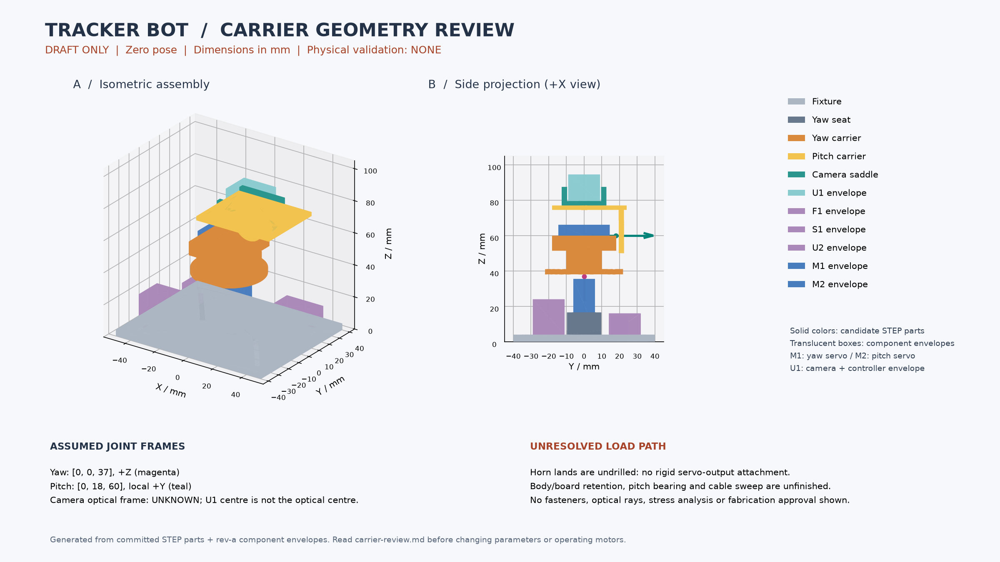

# Candidate carriers and frame convention

These parts explore a load path. They are **not approved for fabrication or motor
operation**. Actual supplied horn attachments, retention and bearing loads remain
unresolved; no spline, horn screw pattern or motor shaft offset is invented.

## Editable files

- [Parameters](carrier-parameters.json); [sampled pose report](carrier-checks.json).
- [Yaw carrier STEP](yaw-carrier-draft.step) / [STL](yaw-carrier-draft.stl).
- [Pitch carrier STEP](pitch-carrier-draft.step) / [STL](pitch-carrier-draft.stl).
- [Revised fixture STEP](carrier-fixture-plate.step) / [STL](carrier-fixture-plate.stl).
- [Eleven-solid assembly STEP](carrier-layout.step), including component envelopes.

Generate in order with CadQuery 2.8.0:

```sh
python tools/build_engineering.py --cad
python tools/build_mounts.py
python tools/build_carriers.py
python -m unittest discover -s tests -p test_frames.py
```

The yaw deck is above M1, joined by two risers to M2's seat. The seat's +Y wall
is open toward the assumed horn side. The pitch plate is outside that case face,
with an upright and shelf under the existing camera saddle. Horn lands are
deliberately undrilled. This is not a rigid connection to either servo output.

The carrier fixture adds two 3.4 mm yaw-seat holes at X=±18.1, Y=0 mm to the
original plate. Camera shelf holes align to the saddle slots at X=-2.6 and 32.6,
Y=0 mm. Determine screw lengths, nut/tool access and anti-loosening from actual
parts. No hole pattern is added to the servo body or camera electronics.

## Frames — assumptions, not calibration

World frame is the plate centre in XY, plate bottom Z=0, +Z up. Right-handed
positive yaw rotates about +Z; positive pitch rotates about local +Y. The pitch
frame travels with the yaw carrier. Point math applies local pitch first, then
world yaw. All lengths are millimetres, all planning angles degrees.

| Reference | Zero-pose origin | Direction / interpretation |
| --- | --- | --- |
| Yaw joint | (0,0,37) | +Z; assumed shaft line |
| Pitch joint in yaw-zero frame | (0,18,60) | +Y; assumed shaft line |
| Camera envelope centre | (15,0,87) | Bounding-box centre only |
| Camera optical frame | Unknown (`null`) | Must come from board/lens measurements and calibration |

The manufacturer's [SG90 page](https://towerpro.com.tw/product/sg90-analog/)
supports the case dimensions used earlier, but not these assumed shaft origins.
No claim is made that 90-degree software commands mechanically zero either axis.
Actual sign, gain, pulse mapping and end stops must be calibrated with horns
removed before supported assembly testing. Do not widen firmware limits from CAD.

## Sampled motion review

The generator reads current firmware min/centre/max commands and requires sample
endpoints matching their offsets: yaw ±30, pitch ±20 at this revision. It samples
five values per axis (25 poses), testing moving candidate solids and component
boxes against each other and fixed boxes, yaw seat and fixture. Intended contact
surfaces are allowed; positive-volume intrusions above 1e-5 mm3 are reported and
make the script fail after writing the report.

The current 25 samples have no detected intrusion. This is **not continuous
collision clearance**: gaps can be zero, boxes omit ears/horns/fasteners, and
wires/USB cables, tolerances, deflection and fingers are not modeled. Camera-frame
math is checked independently against the CAD-transformed envelope centre.
No camera viewing ray or sensor protection zone is claimed.

## Teaching / measurement worksheet

1. Identify fixed, yaw-moving and pitch-moving bodies in the STEP assembly.
2. Predict the pitch-axis direction after +30 degrees yaw; compare the report.
3. Explain why replacing a camera-envelope centre with an optical centre is wrong.
4. With power removed, measure actual servo shaft offsets/horn planes and camera
   interfaces. Record uncertainty and the exact part revision.
5. Update parameters, inspect all sample intrusions, then perform a separate
   continuous swept-volume and wire-routing review. Do not suppress failures.

| Gate | Evidence |
| --- | --- |
| Actual yaw/pitch shaft offsets and horn planes | pending |
| Supplied horns, screw engagement, carrier attachment | pending |
| Positive body/board retention and opposite pitch bearing | pending |
| Camera optical pose, antenna and USB keepouts | pending |
| Load, backlash, support deflection and thermal limits | pending |
| Cable sweep, pinch points and full travel clearances | pending |
| Supported physical travel and stop test | pending |

No physical result is inferred from the generated report.

## Visual review and source freshness



The [render ledger](carrier-visual-review.json) identifies all 11 bodies and hashes
its input STEP files, component manifest, frame parameters and rendering script.
Candidate solids come from their individual STEP files; component boxes come
from the manifest. Before rendering, each body is matched one-to-one with the
saved assembly by volume (within 1e-4 mm3) and bounds (within 1e-4 mm). Matching
these signatures does not prove topological identity or mechanical fit.

The image has been visually inspected at zero pose. It shows the vertical stack,
camera/controller envelope above the saddle, offset pitch plate and unresolved
horn gaps. It is not a dimensioned manufacturing drawing: tessellation and
translucent-surface depth ordering can obscure faces. Read the editable solids
for geometry; do not measure clearances or hole locations from image pixels.
The yaw axis is partly occluded by the carrier; its magenta origin and the frame
table identify the assumption. No optical ray or actual shaft shape is invented.

Reproduce with CadQuery 2.8.0 and Matplotlib 3.11.2:

```sh
python tools/render_carrier_review.py
python -m unittest discover -s tests -p test_visual_review.py
```

The renderer reads existing geometry and does not modify STEP/STL sources. The
lightweight CI test checks the committed image/ledger are current; it does not
install CAD software or recompute solids. If source hashes change, regenerate
and visually inspect the new image before committing. JSON/Python line endings
are normalized for hashes; STEP/PNG retain native bytes. Renderer versions may
change tessellation or pixels, so keep both the updated image and ledger.
